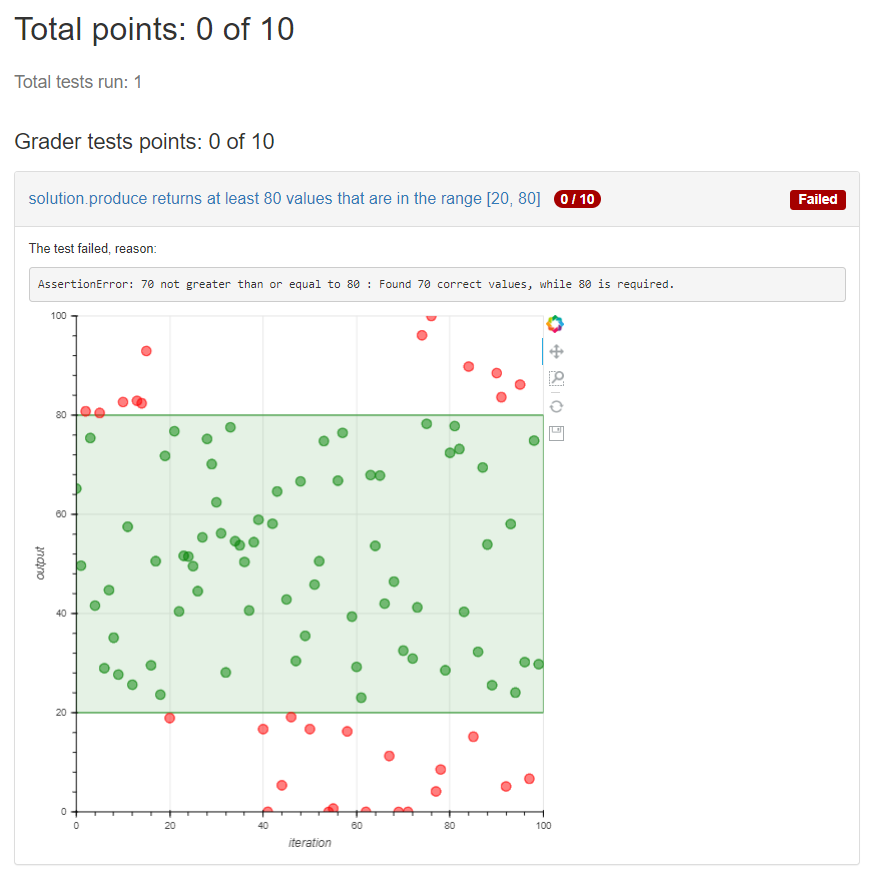

This example shows how to embed arbitrary JavaScript into the feedback template, and make data from grader tests available for the scripts.



You need to first install the plotting library used by this example:
```
pip install -r requirements.txt
```

Then run the tests and render the results into HTML:
```
python3 -m graderutils.main test_config.yaml --develop-mode | python3 -m graderutils_format.html --full-document > results.html
```
You can now view `results.html` in a browser.
